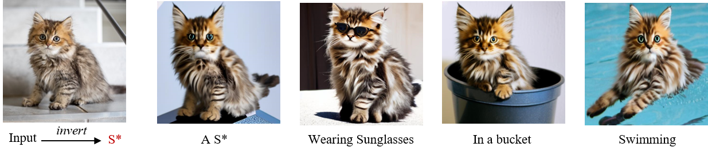

# ELITE: Encoding Visual Concepts into Textual Embeddings for Customized Text-to-Image Generation


<a href="https://arxiv.org/pdf/2302.13848.pdf"></a>
<a href="https://huggingface.co/spaces/ELITE-library/ELITE"></a>




## Method Details


Given an image indicates the target concept (usually an object), we propose a learning-based encoder ELITE to encode the visual concept into the textual embeddings, which can be further flexibly composed into new scenes.  It consists of two modules: (a) a global mapping network is first trained to encode a concept image into multiple textual word embeddings, where one primary word (w0) for well-editable concept and other auxiliary words (w1···N) to exclude irrelevant disturbances. (b) A local mapping network is further trained, which projects the foreground object into textual feature space to provide local details.


## Getting Started

### Environment Setup

```shell
git clone https://github.com/csyxwei/ELITE.git
cd ELITE
conda create -n elite python=3.9
conda activate elite
pip install -r requirements.txt
```

### Pretrained Models

We provide the pretrained checkpoints in [Google Drive](https://drive.google.com/drive/folders/1VkiVZzA_i9gbfuzvHaLH2VYh7kOTzE0x?usp=sharing). One can download them and save to the directory `checkpoints`.

### Setting up HuggingFace

Our code is built on the [diffusers](https://github.com/huggingface/diffusers/) version of Stable Diffusion, you need to accept the [model license](https://huggingface.co/CompVis/stable-diffusion-v1-4) before downloading or using the weights. In our experiments, we use model version v1-4.

You have to be a registered user in Hugging Face Hub, and you'll also need to use an access token for the code to work. For more information on access tokens, please refer to [this section of the documentation](https://huggingface.co/docs/hub/security-tokens).

Run the following command to authenticate your token
```shell
huggingface-cli login
```
If you have already cloned the repo, then you won't need to go through these steps.

### Customized Generation

We provide some testing images in [test_datasets](./test_datasets), which contains both images and object masks. For testing, you can run, 
```
export MODEL_NAME="CompVis/stable-diffusion-v1-4"
export DATA_DIR='./test_datasets/'
CUDA_VISIBLE_DEVICES=0 python inference_local.py \
  --pretrained_model_name_or_path=$MODEL_NAME \
  --test_data_dir=$DATA_DIR \
  --output_dir="./outputs/local_mapping"  \
  --suffix="object" \
  --template="a photo of a S" \
  --llambda="0.8" \
  --global_mapper_path="./checkpoints/global_mapper.pt" \
  --local_mapper_path="./checkpoints/local_mapper.pt"
```
or you can use the shell script,
```
bash inference_local.sh
```
If you want to test your customized dataset, you should align the image to ensure the object is at the center of image, and also provide the corresponding object mask. The object mask can be obtained by [image-matting-app](https://huggingface.co/spaces/SankarSrin/image-matting-app), or other image matting methods.


### Gradio Demo

We also provide a UI for testing our method that is built with gradio. This demo also supports generating new directions on the fly! Running the following command in a terminal will launch the demo:

```python
python app_gradio.py
```

Or you can try the online demo [here](https://huggingface.co/spaces/ELITE-library/ELITE).

## Training

### Preparing Dataset

We use the **test** dataset of Open-Images V6 to train our ELITE. You can prepare the dataset as follows:

- Download Open-Images test dataset from [CVDF's site](https://github.com/cvdfoundation/open-images-dataset#download-images-with-bounding-boxes-annotations) and unzip it to the directory `datasets/Open_Images/images/test`.
- Download class names file `oidv6-class-descriptions.csv` of Open-Images test dataset from [Open-Images official site](https://storage.googleapis.com/openimages/web/download_v7.html#download-manually) and save it to the directory `datasets/Open_Images/annotations/`.
- Download bbox annotations file `test-annotations-bbox.csv` of Open-Images test dataset from [Open-Images official site](https://storage.googleapis.com/openimages/web/download_v7.html#download-manually) and save it to the directory `datasets/Open_Images/annotations/`.
- Download segmentation annotations of Open-Images test dataset from [Open-Images official site](https://storage.googleapis.com/openimages/web/download_v7.html#download-manually) and unzip them to the directory `datasets/Open_Images/segs/test`. And put the `test-annotations-object-segmentation.csv` into `datasets/Open_Images/annotations/`. 
- Obtain the mask bbox by running the following command:
    ```shell
    python data_scripts/cal_bbox_by_seg.py
    ```

The final data structure is like this:

```
datasets
├── Open_Images
│  ├── annotations
│  │  ├── oidv6-class-descriptions.csv
│  │  ├── test-annotations-object-segmentation.csv
│  │  ├── test-annotations-bbox.csv
│  ├── images
│  │  ├── test
│  │  │  ├── xxx.jpg
│  │  │  ├── ...
│  ├── segs
│  │  ├── test
│  │  │  ├── xxx.png
│  │  │  ├── ...
│  │  ├── test_bbox_dict.npy
```

### Training Global Mapping Network

To train the global mapping network, you can run,

```Shell
export MODEL_NAME="CompVis/stable-diffusion-v1-4"
export DATA_DIR='./datasets/Open_Images/'
CUDA_VISIBLE_DEVICES=0,1,2,3 accelerate launch --config_file 4_gpu.json --main_process_port 25656 train_global.py \
  --pretrained_model_name_or_path=$MODEL_NAME \
  --train_data_dir=$DATA_DIR \
  --placeholder_token="S" \
  --resolution=512 \
  --train_batch_size=4 \
  --gradient_accumulation_steps=4 \
  --max_train_steps=200000 \
  --learning_rate=1e-06 --scale_lr \
  --lr_scheduler="constant" \
  --lr_warmup_steps=0 \
  --output_dir="./elite_experiments/global_mapping" \
  --save_steps 200
```
or you can use the shell script,
```shell
bash train_global.sh
```

### Training Local Mapping Network

After the global mapping network is trained, you can train the local mapping network by running,

```Shell
export MODEL_NAME="CompVis/stable-diffusion-v1-4"
export DATA_DIR='/home/weiyuxiang/datasets/Open_Images/'
CUDA_VISIBLE_DEVICES=0,1,2,3 accelerate launch --config_file 4_gpu.json --main_process_port 25657 train_local.py \
  --pretrained_model_name_or_path=$MODEL_NAME \
  --train_data_dir=$DATA_DIR \
  --placeholder_token="S" \
  --resolution=512 \
  --train_batch_size=2 \
  --gradient_accumulation_steps=4 \
  --max_train_steps=200000 \
  --learning_rate=1e-5 --scale_lr \
  --lr_scheduler="constant" \
  --lr_warmup_steps=0 \
  --global_mapper_path "./elite_experiments/global_mapping/mapper_070000.pt" \
  --output_dir="./elite_experiments/local_mapping" \
  --save_steps 200
```
or you can use the shell script,
```shell
bash train_local.sh
```


## Citation

```
@article{wei2023elite,
  title={ELITE: Encoding Visual Concepts into Textual Embeddings for Customized Text-to-Image Generation},
  author={Wei, Yuxiang and Zhang, Yabo and Ji, Zhilong and Bai, Jinfeng and Zhang, Lei and Zuo, Wangmeng},
  journal={arXiv preprint arXiv:2302.13848},
  year={2023}
}
```

## Acknowledgements

This code is built on [diffusers](https://github.com/huggingface/diffusers/) version of [Stable Diffusion](https://github.com/CompVis/stable-diffusion). We thank the authors for sharing the codes.