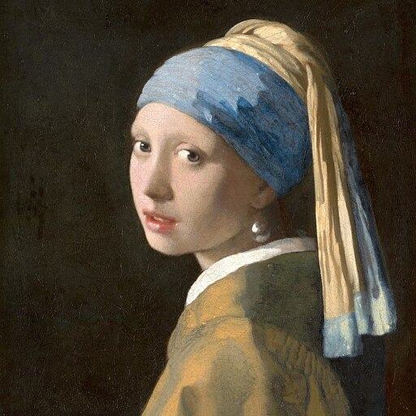
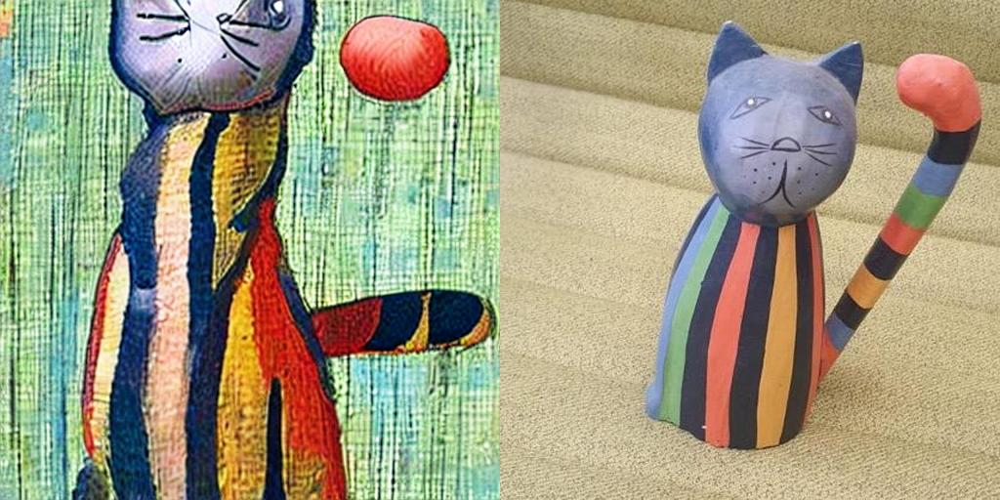
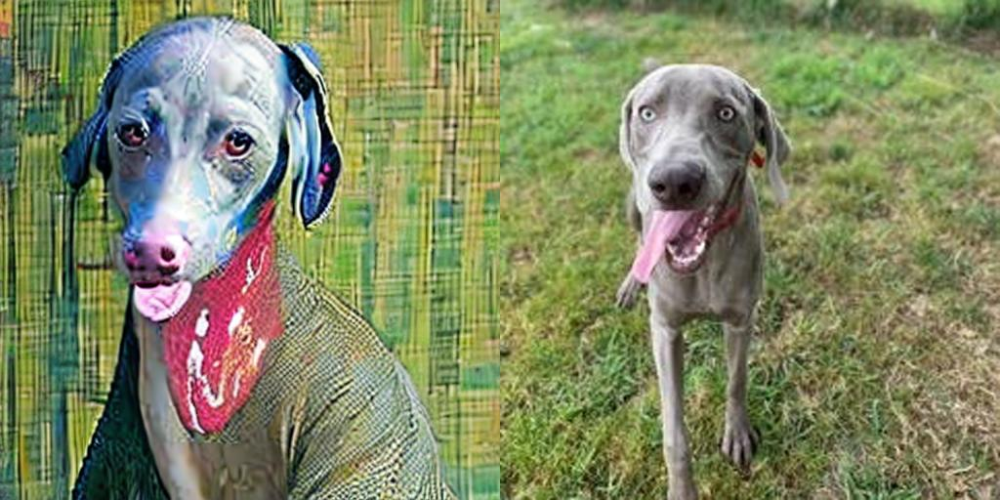
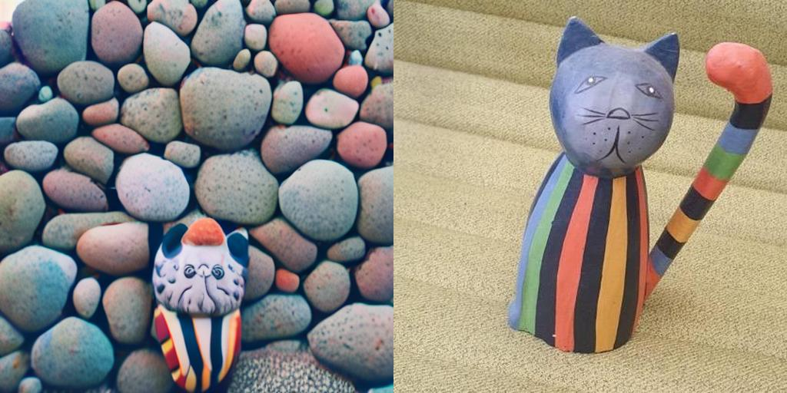
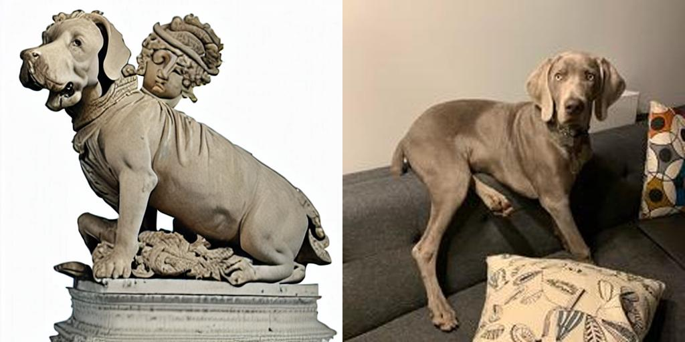
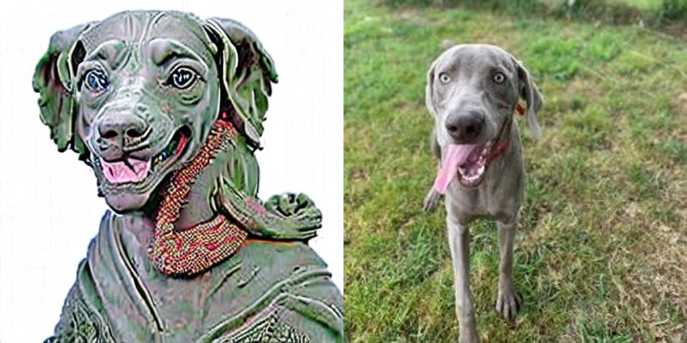

# **ELITE with Control**

ELITE has the ability to create images of a specific object without the need for training. To further enhance control over the generated images, I integrated the use of Ip-Adapter.

Ip-Adapter was originally impelemented with huggingface diffusors >=0.19.3. And the diffusors used in ELITE is 0.11.1 which is lack of many indispensibale features from 0.19.3 to implement Ip-Adapter. I implemented Ip-Adapter here without using diffusors because I found it is eaiser than upgrade the diffusors in ELITE from 0.11.1 to >=0.19.3

ControlNet is on the way!!

# Images with Ip-Adapter

| input to IpAdapter | image1 | image2 |
| ---- | ---- | ---- |
|  |  |  |
|  |  |  |
|  |  |  |
