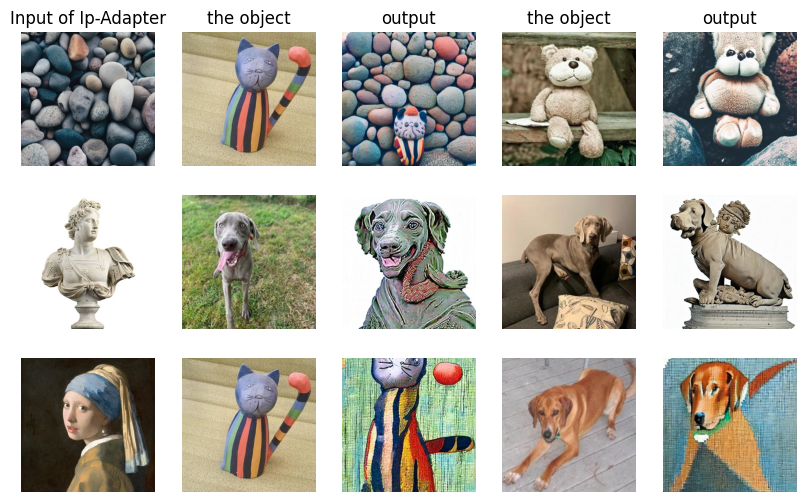

# **ELITE with Control**

ELITE has the ability to create images of a specific object without the need for training. To further enhance control over the generated images, I integrated the use of Ip-Adapter.

### Ip-Adapter



Ip-Adapter was originally impelemented with huggingface diffusors >=0.19.3. And the diffusors used in ELITE is 0.11.1 which is lack of many indispensibale features compared to 0.19.3 for implementing Ip-Adapter. I implemented Ip-Adapter here without using diffusors because it is eaiser than upgrade the diffusors.

## Getting Started

### Environment Setup

```shell
git clone https://github.com/Stevada/ELITE_plus_Control.git
cd ELITE_pluc_Control
conda create -n elite python=3.9
conda activate elite
pip install -r requirements.txt
```

## Inference
Play around with your own image by the inference script.
```shell
sh inferece_local_control.sh
```


## TODO
ControlNet is on the way!!

## Acknowledgements

This repo is a fork of [ELITE](https://github.com/csyxwei/ELITE) which is built on [diffusers](https://github.com/huggingface/diffusers/) version of [Stable Diffusion](https://github.com/CompVis/stable-diffusion). And reference to [Ip-Adpater](https://github.com/tencent-ailab/IP-Adapter). I sincerely appreciate the authors for sharing the codes.
